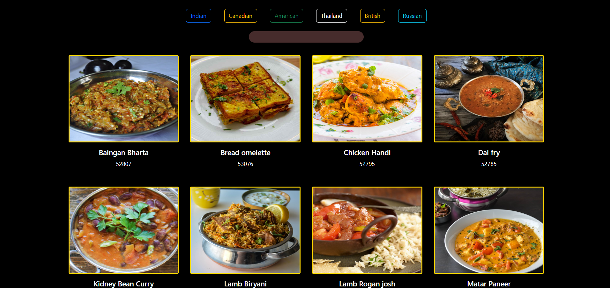
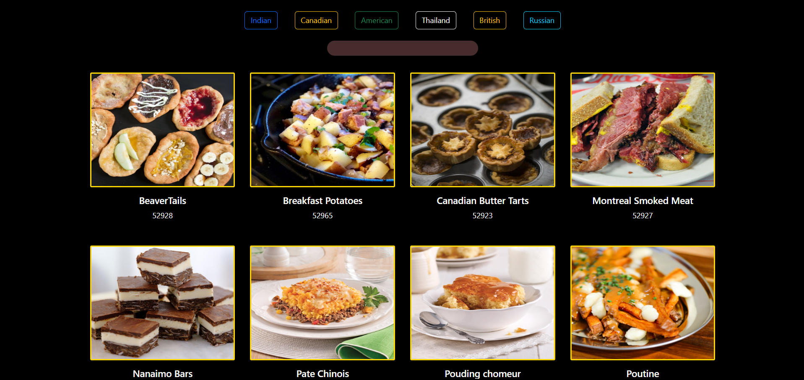
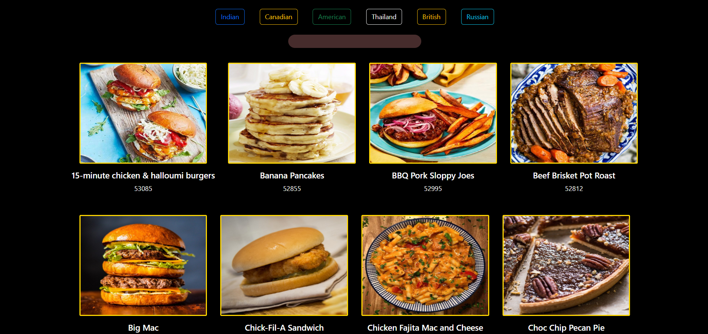
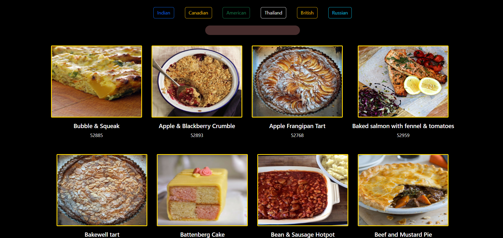
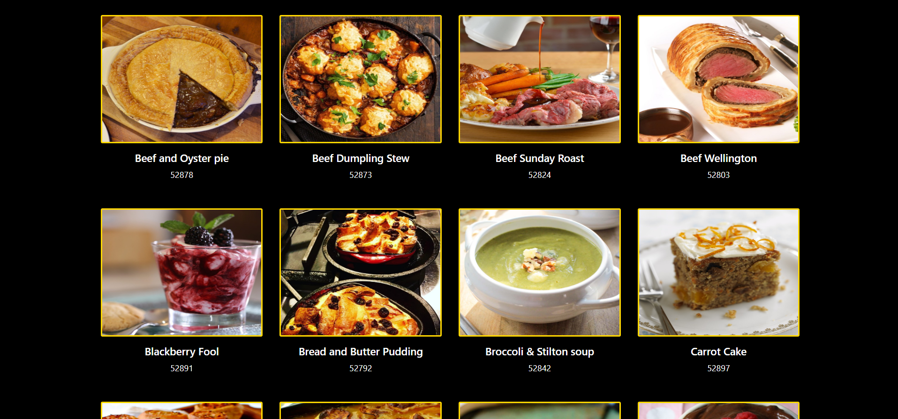
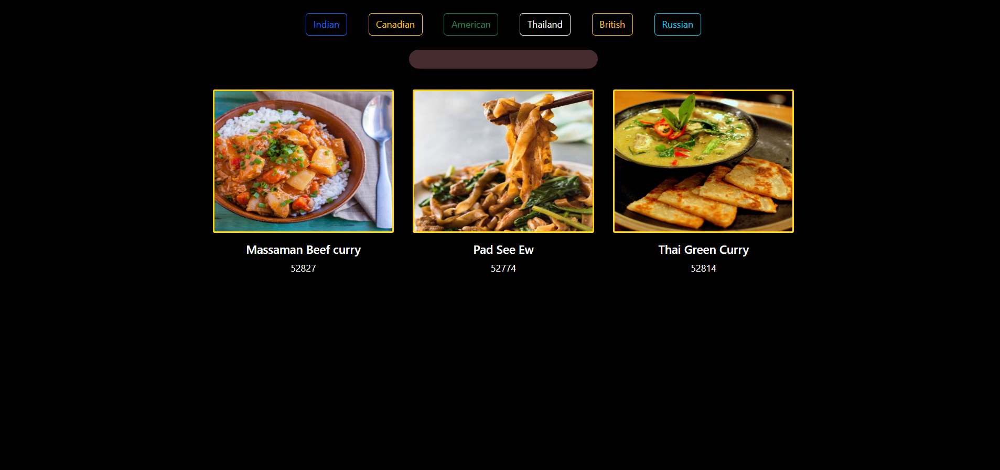
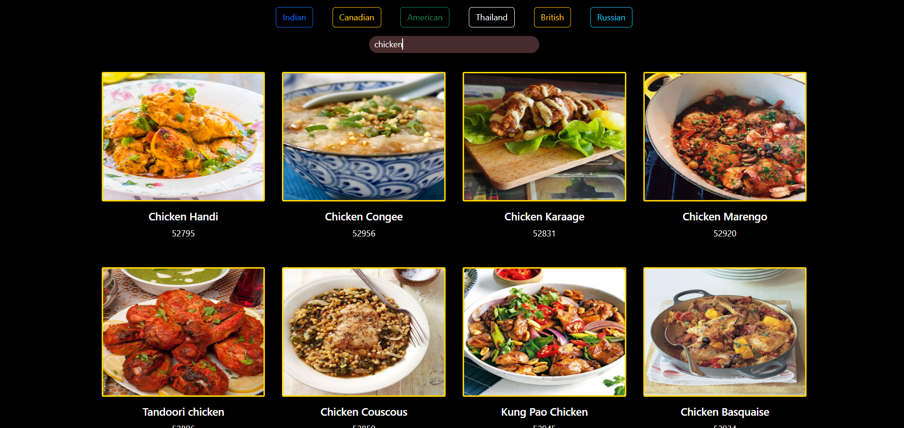

#Readme.md
🌍 World Cuisine Explorer 🍽️
Discover the most famous dishes from different countries! 🇮🇳 🇨🇦 🇹🇭 🇷🇺 🇺🇸 🇬🇧

India:-

Canadian:-

(Replace this with an actual screenshot!)

🚀 About the Project
🍜 World Cuisine Explorer is a web application that allows users to explore famous dishes from various countries using the Meal DB API. The project demonstrates API handling, DOM manipulation, and Bootstrap styling for a smooth user experience! 🎨

American:-

British:-

Thailand:-

🖥️ Technologies Used:

HTML5 – Structure
CSS3 – Styling & animations
Bootstrap – Responsive design
JavaScript – Logic & interactivity
Meal DB API – Fetching dish data
🌟 Features
✔️ View famous dishes from India, Canada, Thailand, Russia, America, and Britain 🌎
✔️ Dynamically fetch dish data using API calls 🔄
✔️ Interactive UI with real-time updates via DOM manipulation 🖱️
✔️ Search feature to find meals by name 🔍
✔️ Responsive design for desktop screens 🖥️

📚 Insights & Learning Experience
While working on this project, I gained valuable insights into:

🔹 API Handling – Learned how to fetch and display data dynamically from an external API (Meal DB).
🔹 Asynchronous JavaScript – Understood how to use fetch() and handle promises efficiently.
🔹 DOM Manipulation – Practiced updating the UI dynamically based on user interactions.
🔹 Error Handling – Implemented strategies to manage API failures and invalid responses.
🔹 Bootstrap Framework – Enhanced styling and made the project responsive with Bootstrap.
🔹 Debugging Skills – Improved my ability to troubleshoot JavaScript errors and API request issues.

💡 This project strengthened my understanding of real-world web development and API integration!

Home Page	Dish Details	Search Feature

📂 Installation & Setup
1️⃣ Clone this repository:

bash
Copy
Edit
git clone [[Copy](https://github.com/PriyanshuAcharya41/Famous_Meal.git)](https://github.com/PriyanshuAcharya41/Famous_Meal.git)
2️⃣ Navigate to the project folder:

bash
Copy
Edit
cd world-cuisine-explorer
3️⃣ Run the application by opening index.html in your browser! 🚀

(No additional setup required!)

🖥️ Live Demo
🔗 Try it here! ([World Cuisine Explorer](https://famous-meal.vercel.app/))

🤝 Contributing
Want to improve this project? 🍕 Fork it, create a branch, and submit a pull request! 🚀

📜 License
📝 This project is licensed under the MIT License – Feel free to modify and share!

📬 Contact
📧 Your Name: Priyanshu Acharya
🔗 GitHub: [Priyanshu_acharya41](https://github.com/PriyanshuAcharya41/)
